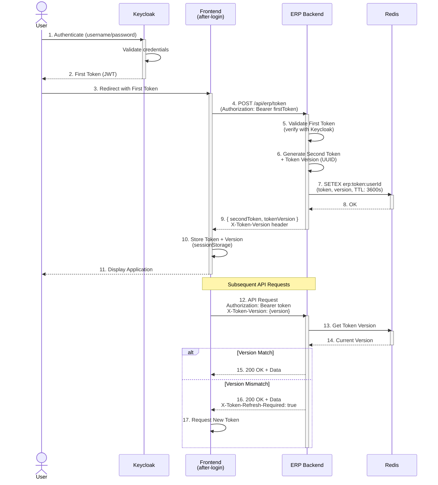

# ERP Technical Info
Documentation for ERP project technical architecture and design.

```mermaid
 
sequenceDiagram
 
    actor User
 
    participant KC as Keycloak
 
    participant FE as Frontend<br/>(after-login)
 
    participant BE as ERP Backend
 
    participant Redis as Redis
 
  
 
    User->>KC: 1. Authenticate (username/password)
 
    activate KC
 
    KC->>KC: Validate credentials
 
    KC-->>User: 2. First Token (JWT)
 
    deactivate KC
 
  
 
    User->>FE: 3. Redirect with First Token
 
    activate FE
 
  
 
    FE->>BE: 4. POST /api/erp/token<br/>(Authorization: Bearer firstToken)
 
    activate BE
 
  
 
    BE->>BE: 5. Validate First Token<br/>(verify with Keycloak)
 
    BE->>BE: 6. Generate Second Token<br/>+ Token Version (UUID)
 
  
 
    BE->>Redis: 7. SETEX erp:token:userId<br/>(token, version, TTL: 3600s)
 
    activate Redis
 
    Redis-->>BE: 8. OK
 
    deactivate Redis
 
  
 
    BE-->>FE: 9. { secondToken, tokenVersion }<br/>X-Token-Version header
 
    deactivate BE
 
  
 
    FE->>FE: 10. Store Token + Version<br/>(sessionStorage)
 
    FE-->>User: 11. Display Application
 
    deactivate FE
 
  
 
    Note over FE,BE: Subsequent API Requests
 
  
 
    FE->>BE: 12. API Request<br/>Authorization: Bearer token<br/>X-Token-Version: {version}
 
    activate BE
 
    BE->>Redis: 13. Get Token Version
 
    activate Redis
 
    Redis-->>BE: 14. Current Version
 
    deactivate Redis
 
    alt Version Match
 
        BE-->>FE: 15. 200 OK + Data
 
    else Version Mismatch
 
        BE-->>FE: 16. 200 OK + Data<br/>X-Token-Refresh-Required: true
 
        FE->>FE: 17. Request New Token
 
    end
 
    deactivate BE
```